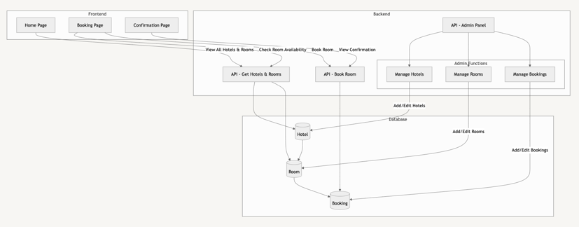
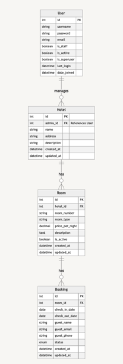

# Hotel1 Booking System

Hey, it's nice to see you here :)

We dont have The Well yet, but stay tuned! Instead it is Hotel1.
Book your stay here (yes, i deployed it):  
[https://yuliademchyna.pythonanywhere.com](https://yuliademchyna.pythonanywhere.com)
On the website you call log in to admin panel with user: yuliademchyna and pass: test
at [https://yuliademchyna.pythonanywhere.com/admin](https://yuliademchyna.pythonanywhere.com/admin)


## Architecture Diagram


## ER Diagram


## Running The Project Locally

1. **Navigate to Project Directory**
   ```bash
   cd ~/hotel_booking_project
   ```

2. **Create a Virtual Environment**
   ```bash
   python3 -m venv myenv
   ```

3. **Activate the Virtual Environment**
   
   *On macOS/Linux:*
   ```bash
   source myenv/bin/activate
   ```
   
   *On Windows:*
   ```bash
   myenv\Scripts\activate
   ```

4. **Install Project Dependencies**
   ```bash
   pip install -r requirements.txt
   ```

5. **Apply Database Migrations**
   ```bash
   python manage.py migrate
   ```

6. **Create a Superuser (Optional)**
   ```bash
   python manage.py createsuperuser
   ```
   Follow the prompts to set up your admin credentials.

7. **Run the Development Server**
   ```bash
   python manage.py runserver
   ```

8. **Access the Application**
   
   Open your web browser and navigate to [http://127.0.0.1:8000/](http://127.0.0.1:8000/)